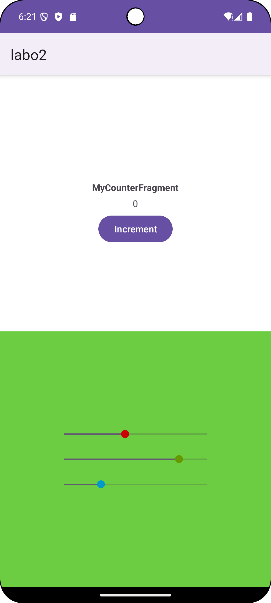
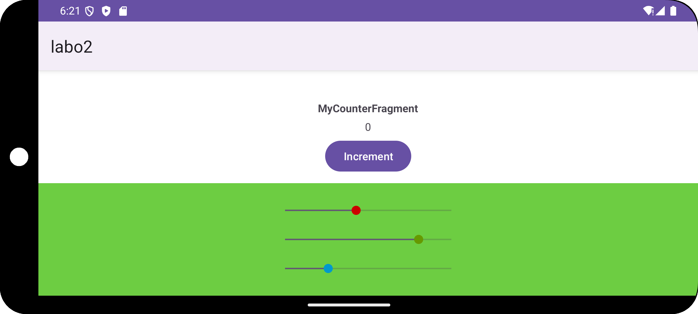
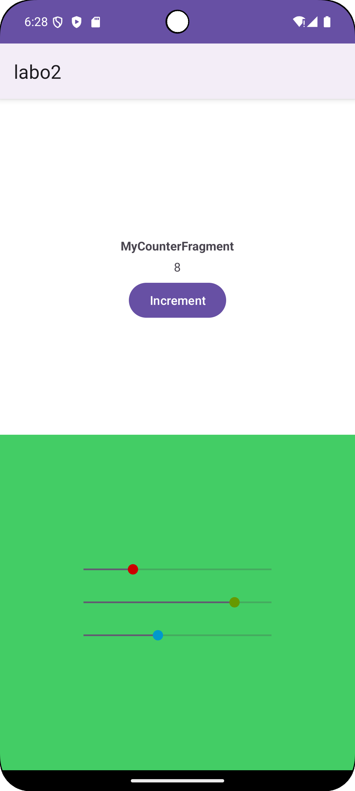
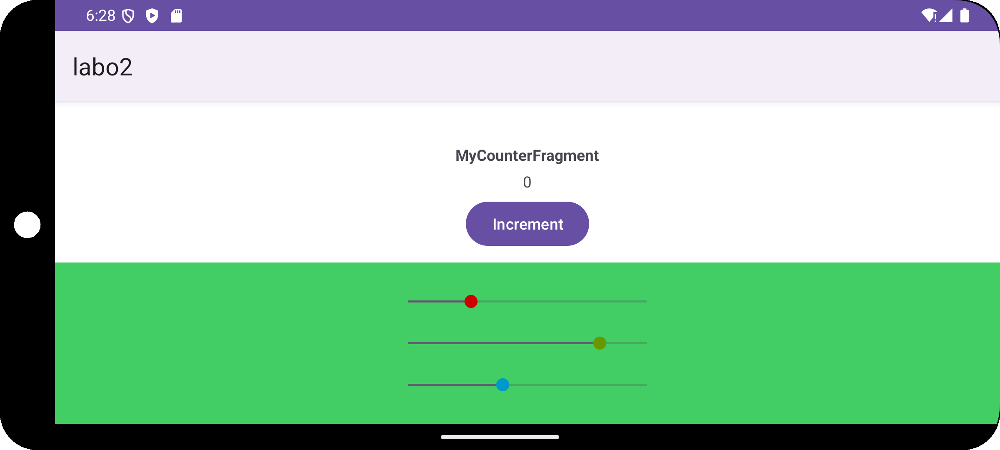

# DAA - Rapport Laboratoire 2

###### auteurs: Rachel Tranchida, Massimo Stefani, Eva Ray

## Application

L'application contient 4 activités:

- 'MainActivity' qui sert à lancer l'application pour la manipulation 1.
- 'InputNameActivity' qui est l'activité secondaire de la manipulation 1.
- 'MainActivityFragment1' qui sert à lancer l'application pour la manipulation 2.
- 'MainActivityFragment2' qui sert à lancer l'application pour la manipulation 3.

Pour avoir accès aux différentes manipulations du laboratoire, il faut changer le fichier
'AndroidManifest.xml'. Dans la balise 'activity' principale, il suffit de changer la string
dans 'android:name' par le nom de l'activité qui permet de lancer l'application pour la
manipulation à laquelle vous souhaitez avoir accès.

```xml

<activity android:name="<Nom de l'activité choisie>" android:exported="true">
    <intent-filter>
        <action android:name="android.intent.action.MAIN" />
        <category android:name="android.intent.category.LAUNCHER" />
    </intent-filter>
</activity>
```

## Manipulations

### Les activités

#### Que se passe-t-il si l’utilisateur appuie sur « back » lorsqu’il se trouve sur la seconde Activité ?

Si on n'a pas encore entré de nom et qu'on appuie sur "back" lorsqu'on se trouve sur la deuxième
activité, on retourne sur la première activité et le texte affichl est "Bienvenue, veuillez entrer
votre nom". Si on a déjà entré un nom précédemment, par exemple, "John" et qu'on appuie sur "back"
lorsqu'on se trouve sur
la seconde activité, on retourne sur la première activité et le texte affiché est "Bienvenue
John !".

Cela se passe car lorqu'on appuie sur "back" depuis la première activité sans avoir sauvé, c'est
un objet null qui est passé à la première activité. Dans la fonction 'getName', on update le champ
'username' uniquement si l'objet reçu n'est pas null. La fonction 'updateName' est ensuite appelée
et affiche la string de base si le username est null ou le string qui souhaite la bienvenue de
manière
personnelle si le username n'est pas null. C'est donc pour cela que nous avons le résultat observé.

#### Veuillez réaliser un diagramme des changements d’état des deux Activités pour les utilisations suivantes, vous mettrez en évidence les différentes instances de chaque Activité

L’utilisateur ouvre l’application, clique sur le bouton éditer, renseigne son prénom et sauve


L’utilisateur ouvre l’application en mode portrait, clique sur le bouton éditer, bascule en 
mode paysage, renseigne son prénom et sauve.


#### Que faut-il mettre en place pour que vos Activités supportent la rotation de l’écran ? Est-ce nécessaire de le réaliser pour les deux Activités, quelle est la différence ?

Lorsqu'on tourne l'écran, Android relance l'activité qui est en train de run ('onDestroy()' est
appelée, suivie de 'onCreate()'). Par conséquent, le champ "username" est réinitialisé. C'est pour
cela que lorsqu'on entre son nom, qu'on sauve et qu'on tourne l'écran, la string affichée est
"Bienvenue, veuillez entrer votre nom" et non pas celle qui shouhaite la bienvenue.

Si on souhaite que les activités supportent la rotation de l'écran, il faut override les fonctions
'onSaveInstanceState' et 'onRestoreInstanceState'. La méthode 'onSaveInstanceState' permet de
sauvegarder l'état actuel de l'activité dans un bundle avant sa destruction, et
'onRestoreInstanceState' permet de restaurer cet état lorsque l'activité est recréée.

Il est nécessaire d'override ces méthodes uniquement pour la première activité. En effet,
c'est elle qui contient l'état 'username' qui doit être sauvegardé. En ce qui concerne la deuxième
activité, son 'EditText' conserve son état automatiquement grâce à la sauvegarde automatique des
vues d'Android, puisqu'il hérite directement de 'View'.

### Les fragments, premiers pas

#### Les deux Fragments fournis implémentent la restauration de leur état. Si on enlève la sauvegarde de l’état sur le ColorFragment sa couleur sera tout de même restaurée, comment pouvons-nous expliquer cela ?

##### Étude du comportement des Fragments lors de la restauration de l'état

Dans cette étude, nous analysons le comportement de deux Fragments Android, `ColorFragment` et
`CounterFragment`, lors d'un changement d'orientation de l'écran. Nous nous intéressons
particulièrement à la restauration de leur état sans implémenter explicitement la méthode
`onSaveInstanceState()`.

---

1. Suppression de la sauvegarde de l'état dans `ColorFragment`

##### Étapes réalisées

- **Suppression de la méthode de sauvegarde** : Nous retirons la fonction responsable de la
  sauvegarde de l'état du fragment.

- **Observation du comportement** : Après un changement d'orientation de l'écran, nous constatons
  que la couleur du fragment est **toujours restaurée**, même sans la sauvegarde explicite de
  l'état.

  

  *ColorFragment avant rotation*

  

*ColorFragment après rotation*

---

2. Suppression de la sauvegarde de l'état dans `CounterFragment`

##### Étapes réalisées

- **Suppression de la méthode de sauvegarde** : De la même manière, nous supprimons la fonction de
  sauvegarde de l'état du `CounterFragment`.

- **Observation du comportement** : Après un changement d'orientation, nous remarquons que la valeur
  du compteur **n'est pas restaurée** et revient à sa valeur initiale.

  

  *Avant rotation*

  

  *Après rotation*


3. Analyse des différences entre les deux Fragments

##### Comportements observés

- **`ColorFragment`** : La couleur est restaurée malgré l'absence de sauvegarde explicite.
- **`CounterFragment`** : Le compteur n'est pas restauré sans sauvegarde explicite.

##### Propriétés des Fragments

- **`ColorFragment`** :

    - Utilise des attributs de type `Int` pour stocker la couleur.
    - Possède trois `SeekBar` (`rSeekBar`, `gSeekBar`, `bSeekBar`) pour ajuster les composantes RGB.
    - Met à jour la couleur de fond en fonction des valeurs des `SeekBar`.

- **`CounterFragment`** :

    - Utilise un attribut de type `Int` pour stocker le compteur.
    - Affiche le compteur dans un `TextView` et l'incrémente via un `Button`.
    - Met à jour le `TextView` à chaque incrémentation du compteur.

##### Mécanisme de sauvegarde automatique des vues en Android

En Android, les vues (héritant de `View`) possédant un identifiant unique (`android:id`) et ayant la
propriété `saveEnabled` à `true` (par défaut) sauvegardent et restaurent automatiquement leur état
lors des changements de configuration.

- **Vues concernées** : `EditText`, `CheckBox`, `SeekBar`, etc.
- **Données sauvegardées** : Propriétés telles que le texte saisi, l'état coché, la progression,
  etc.

##### Application au `ColorFragment`

- **Sauvegarde automatique des `SeekBar`** :

    - Les `SeekBar` sauvegardent automatiquement leur position (`progress`).
    - Lors de la restauration, les positions sont rétablies, déclenchant les écouteurs associés.

- **Mise à jour de la couleur** :

    - `seekBarChangeListener` est appelé lors de la restauration.
    - Il met à jour la variable `color` et applique la couleur au fond du fragment.

  ```kotlin
  private val seekBarChangeListener = object : SeekBar.OnSeekBarChangeListener {

      override fun onProgressChanged(seekBar: SeekBar, value: Int, fromUser: Boolean) {
          val rComponent = Color.red(color)
          val gComponent = Color.green(color)
          val bComponent = Color.blue(color)

          color = when(seekBar) {
              rSeekBar -> Color.rgb(value, gComponent, bComponent)
              gSeekBar -> Color.rgb(rComponent, value, bComponent)
              bSeekBar -> Color.rgb(rComponent, gComponent, value)
              else -> Color.rgb(rComponent, gComponent, bComponent)
          }

          // Mise à jour de la couleur de fond
          view?.setBackgroundColor(color)
      }

      override fun onStartTrackingTouch(p0: SeekBar?) = Unit
      override fun onStopTrackingTouch(p0: SeekBar?) = Unit

  }
  ```

##### Application au `CounterFragment`

- **Absence de sauvegarde automatique** :

    - Le compteur est une variable primitive (`Int`), non liée à une vue avec sauvegarde
      automatique.
    - Sans sauvegarde explicite, sa valeur est réinitialisée lors de la recréation du fragment.

---

##### Conclusion

La différence de comportement entre les deux fragments s'explique par le mécanisme de sauvegarde
automatique des vues en Android :

- **`ColorFragment`** :

    - **Sauvegarde automatique** : Les `SeekBar` sauvegardent et restaurent automatiquement leur
      état.
    - **Mise à jour dynamique** : Le `SeekBarChangeListener` met à jour la variable `color` et la
      couleur de fond en conséquence.

- **`CounterFragment`** :

    - **Absence de sauvegarde** : Le compteur n'est pas sauvegardé automatiquement car il n'est pas
      lié à une vue.
    - **Réinitialisation** : Sans sauvegarde explicite, le compteur revient à sa valeur initiale
      après rotation.

---

#### Si nous plaçons deux fois le CounterFragment dans l’Activité, nous aurons deux instances indépendantes de celui-ci. Comment est-ce que la restauration de l’état se passe en cas de rotation de l’écran ?

Comme vu précédemment, le `CounterFragment` garde son état si la méthode `onSaveInstanceState` est
implémentée.
Si on place deux instances du `CounterFragment` dans l'activité, chaque instance aura son propre
état.
Lors d'un changement d'orientation de l'écran, chaque instance du `CounterFragment` restaurera son
propre état.
Les deux instances du `CounterFragment` sont indépendantes l'une de l'autre.

3. Références

- [Documentation officielle d'Android sur les Fragments](https://developer.android.com/guide/fragments)
- [Mécanismes de sauvegarde d'état en Android](https://developer.android.com/topic/libraries/architecture/saving-states)
- [Classe
  `SeekBar` (Android Developers)](https://developer.android.com/reference/android/widget/SeekBar)
- [Propriété `saveEnabled` de
  `View`](https://developer.android.com/reference/android/view/View#attr_android:saveEnabled)

### Le FragmentManager

#### A l’initialisation de l’Activité, comment peut-on faire en sorte que la première étape s’affiche automatiquement ?

On crée et ajoute le premier fragment à la création avec l'argument de step valant 1 seulement dans
le cas où l'activité est nouvelle et qu'il n'y a pas d'état sauvegardé. En effet, on vérifie si
`savedInstanceState` est null et c'est seulement dans ce cas que l'on ajoute le premier fragment.

#### Comment pouvez-vous faire en sorte que votre implémentation supporte la rotation de l’écran ? Nous nous intéressons en particulier au maintien de l’état de la pile de Fragments et de l’étape en cours lors de la rotation.

En cas de rotation de l’écran, Android détruit puis recrée l'activité en cours pour gérer les
nouvelles configurations. Par défaut la pile de Fragments est recréée à l’identique par le
FragmentManager, mais pas l’état interne des Fragments. Le paramètre passé aux fragments indiquant
le numéro d'étape est ce qui permet de conserver le numéro de l'étape en cours, car il ne change pas
pour un fragment donné. De plus, au `onCreate()` , on vérifie si une instance a été sauvegardée, ce
qui nous permet de conserver la cohérence de la pile en n'ajoutant pas un fragment à la création si
l'activité est restaurée et pas nouvelle.

#### Dans une transaction sur le Fragment, quelle est la différence entre les méthodes add et replace ?

`add()` :  Ajoute un fragment au conteneur. Si le conteneur possède déjà des fragments, le nouveau
fragment est ajouté par-dessus les autres, créant ainsi une pile de fragments.

`replace()` : Supprime tous les fragments existants dans le conteneur et ajoute le nouveau fragment. 


